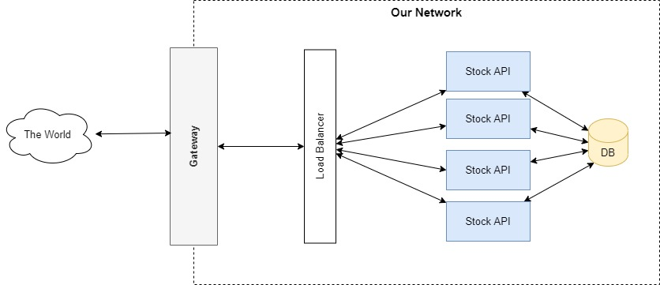

# Stock API #

this API allows callers to add transactions and get the most recent price for a stock.


## Running ##

To run this we require a SQL Server to connect to and a empty DB named      `stockApi` that EF can setup. There is a docker-compose file to setup and run SQL Server if needed, commands below

```
cd tools

docker-compose -f .\docker-compose-dev.yml up -d
```

You should have a local running instance of SQL SErver now on port 1433, if this port is in use please amend the docker-compose-dev file to a free port. Now we need to create a blank DB for EF to use:

```
docker exec -it <containerId> /opt/mssql-tools/bin/sqlcmd -S localhost -U sa -P Password123


USE master
GO

CREATE DATABASE stockApi
GO

exit
```

Open the solution in Visual Studio and hit F5 to run it and it should display a swagger page for you to use. Update the connection string if you changed the port number in the docker-compose file of if you are using your own SQL Server instance.

The DB has some pre-populated data that I have used for testing, the 2 stocks it is aware of are `AAPL` and `BA.` so please use that while testing or feel free to add in your own stocks directly to the DB using SSMS.

## ToDo ##
I ran out of time the commit where I ran out of time is tagged `times-up` but I spent a bit more time just to add to the the functionality to get the prices for multiple stocks in.

### Things I need to finish: ###
- Get a full list of LSE stocks and add them to the DataSeeding script##
- Unit Tests, did not have time to add any for the StockController, but need more of them
- Integration tests to at least check the service is able to start and check the model validations used when adding a transaction.
- Last StockController end point to get all stock prices
- Adding AppInsights for logging / request monitoring
- Load testing


### Improvements ###
- When adding transactions, requests should be signed or at the very least come with an API key in the header. Create a ActionFilter to verify the key before allowing the action.
- Maybe authentication should occur in another service and we vvalidate the token presented with that service.
- For auditability we should probably be logging the IP the transaction requests came from and check these against a predefined set of allowed IPs for the broker
- Move code in to the Stock model so validation of stock symbols etc... can happen in the model (where it should)
- The Stock model should use the Symbol as the key as that should be unique 


### Performance Improvements ###
- Filter unauthenticated requests before it even reaches the service (at least for the Add transactions endpoint)
- Run multiple instances with a load balancer in front of it
- Retrieving the stock price is going to be slow as data increases, it is currently grouping by the symbol and taking the price from the last transaction. Would be better to possibly keep a record of the latest price in the Stocks table with the symbol making the read much more efficient
- The StockController should really change the endpoints to all be GETs for cacheability or add the expires headers to the POSTs to improve the preformance even if it is only for a very short while
- Separate the read from the write

